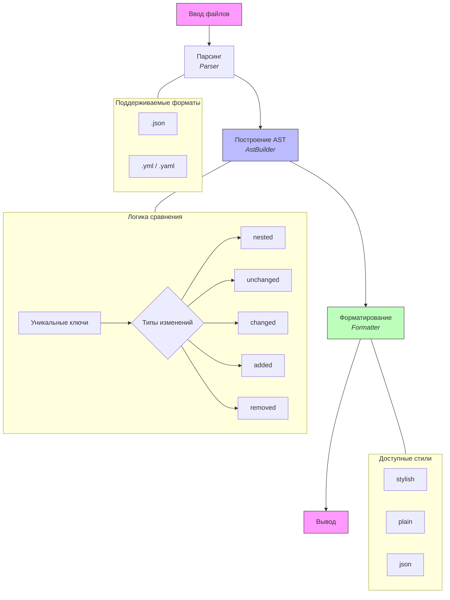

[](https://sonarcloud.io/summary/new_code?id=mmartsinouski-cloud_php-project-48)
[](https://sonarcloud.io/summary/new_code?id=mmartsinouski-cloud_php-project-48)

# Вычислитель отличий (PHP)

Утилита для сравнения двух JSON файлов и вывода различий.
Консольная утилита для сравнения двух файлов конфигурации и отображения различий между ними. Поддерживает форматы JSON
и YAML.


## Пример работы

- https://asciinema.org/a/7WVP90gN4CRPHSDL

## Возможности

- Поддержка входных форматов: JSON, YAML/YML
- Три формата вывода:
    - **stylish** - древовидное представление с визуальными маркерами изменений
    - **plain** - текстовое описание изменений
    - **json** - вывод в JSON формате
- Рекурсивное сравнение вложенных структур
- Детализация всех типов изменений: добавлено, удалено, изменено, без изменений

## Установка

```bash
git clone https://github.com/mmartsinouski-cloud/php-project-48.git
```

##  Архитектура проекта
Проект построен по принципу разделения ответственности (Separation of Concerns) и состоит из нескольких независимых слоев.
Процесс сравнения файлов разбит на 4 этапа:

1. **Parsing**: Чтение файлов и преобразование их в объекты.
2. **AST Construction**: Сравнение двух объектов и создание внутреннего дерева различий.
3. **Formatting**: Преобразование дерева в нужный текстовый формат.
4. **Output**: Вывод результата в консоль.



## Типы узлов AST

| Тип         | Описание               | Поля                                  | Пример вывода                      |
|-------------|------------------------|---------------------------------------|------------------------------------|
| `nested`    | Вложенная структура    | `key`, `type`, `children`             | `common: { ... }`                  |
| `unchanged` | Значение не изменилось | `key`, `type`, `value`                | `host: hexlet.io`                  |
| `changed`   | Значение изменилось    | `key`, `type`, `oldValue`, `newValue` | `- timeout: 50`<br>`+ timeout: 20` |
| `added`     | Ключ добавлен          | `key`, `type`, `value`                | `+ verbose: true`                  |
| `removed`   | Ключ удален            | `key`, `type`, `value`                | `- proxy: 123.234.53.22`           |

## Тестирование
Проект использует PHPUnit для автоматизированного тестирования:


```bash
composer require hexlet/code
make test
```

## Разработка

```bash
# Установка зависимостей
make install


#Проверка стиля кода
make lint


#Автоматическое исправление стиля
make lint-fix


#Запуск с покрытием кода
make test-coverage
```

## Требования
- PHP 8.0 или выше

## Лицензия
- MIT